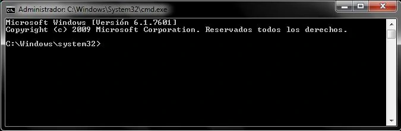
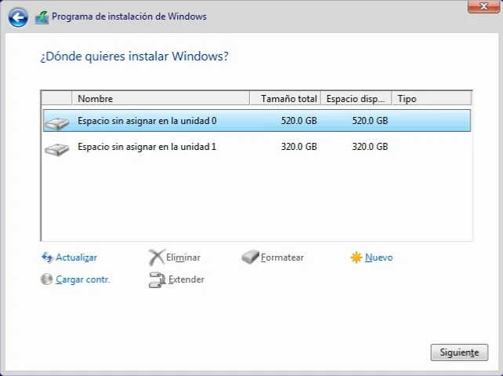
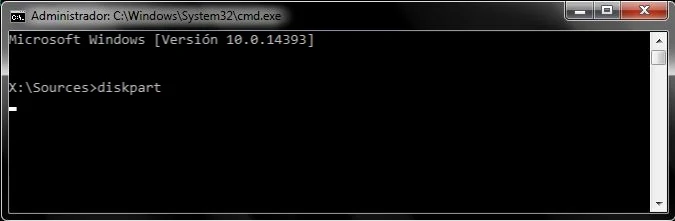

Normalmente te das cuenta que tienes la protección GPT en tu disco cuando aparece el mensaje:
"No se puede instalar Windows en este disco. el disco seleccionado tiene el estilo de partición GPT" y debemos solucionarlo como se muestra en el vídeo.

  <iframe src="https://www.youtube.com/embed/5L5KxvsHZ2Q?rel=0&amp;showinfo=0" />

Los GPT son tablas de partición GUID que tienen algunos discos duros, y esto nos bloquean la instalación de sistemas operativos (SO) en dicho disco. Es por ello que debemos eliminarlos a la hora de alguna instalación de algún SO.

Para quitar la protección GPT de tu disco duro tienes dos opciones, la primera opción es cuando estás navegando en tu computador y el disco con la protección GPT no contiene alojado el sistema operativo windows. La segunda opción es cuando estás instalando un sistema operativo (SO) y el disco donde quieres instalar el SO contiene protección GPT que bloquea el proceso.

## Opción 1: Navegando en tu computador.

Para eliminar el GPT dentro de tu computador, debes realizar los siguientes pasos.

- Lo primero es dirigirse a la barra de windows y buscar en el inicio "CMD" o "Simbolo del sistema" que es mejor conocido como consola; abrimos en modo administrador y debe aparecer `C:\windows\system32>`

- Estando en `C:\windows\system32>` en la consola, debemos escribir diskpart y pulsar enter.

- Cuando aparezca `DISKPART>`, podemos ver la lista de discos en nuestra PC escribiendo `list disk` y pulsando enter.

- Al aparecer la lista de discos, podemos ver cual de ellos tiene protección GPT ya que estará marcado con un asterisco (\*) en la columna de GPT en la parte derecha, y podemos eliminarlo convirtiendo el formato del disco GPT a MBR, o limpiando todo nuestro disco duro para dejarlo como nuevo y sin ningún formato.

> Nota: Cualquiera de las opciones ELIMINA TODO lo que contenga el disco duro, es por eso que debemos tratar de hacer un respaldo de los archivos más importantes antes de continuar.

- Para cambiar de formato, debemos seleccionar el disco duro con el comando `select disk` + el número de disco que deseamos modificar. Ejemplo: si el disco que tiene el GPT es el disco número 1, escribimos `select disk 1` y pulsamos enter.

- Luego debemos escribir el comando `convert mbr` y pulsar enter para convertirlo a MBR.

- Puedes chequear que el GPT se eliminó, escribiendo nuevamente `list disk` y ver que se eliminó el asterisco (\*) en la columna de GPT.

Si realizamos los pasos correctamente, ya no tendremos el HDD o SSD con GPT.

También puedes limpiar todo el disco y así eliminar el formato que tiene; eso se hace de la siguiente manera.

- Primero seleccionamos el disco duro que vamos a limpiar con el comando `select disk` + el número del disco y pulsamos enter.

- Por ultimo debemos escribir el comando para limpiar que es `clean` y pulsar enter; esto limpiará todo el disco dejándolo sin formato y sin protección GPT.

## Opción 2: Instalando un sistema operativo (SO).

Cuando estamos instalando un SO en una PC y el proceso se ve interrumpido por un disco duro GPT, debemos realizar los siguientes pasos para poder eliminarlo.

- Primero debemos llegar al menú donde se pueden modificar los discos duros.

- Luego debemos pulsar las teclas `SHIFT+F10` para que se abra la consola.

- Estando en `X:\Sources>` en la consola, debemos escribir `diskpart` y pulsar enter.

- Cuando aparezca `DISKPART>`, podemos ver la lista de discos en nuestra PC escribiendo `list disk` y pulsando enter.

- Al aparecer la lista de discos, podemos ver cual de ellos tiene protección GPT ya que estará marcado con un asterisco (\*) en la columna de GPT en la parte derecha, y podemos eliminarlo convirtiendo el formato del disco GPT a MBR, o limpiando todo nuestro disco duro para dejarlo como nuevo y sin ningún formato.

> Nota: Cualquiera de las opciones ELIMINA TODO lo que contenga el disco duro, es por eso que debemos tratar de hacer un respaldo de los archivos más importantes antes de continuar.

- Para cambiar de formato, debemos seleccionar el disco duro con el comando `select disk` + el número de disco que deseamos modificar. Ejemplo: si el disco que tiene el GPT es el disco número 1, escribimos `select disk 1` y pulsamos enter.

- Luego debemos escribir el comando `convert mbr` y pulsar enter para convertirlo a MBR.

- Puedes chequear que el GPT se eliminó, escribiendo nuevamente `list disk` y ver que se eliminó el asterisco (\*) en la columna de GPT.

Ahora ya podemos instalar el SO tranquilamente.

También puedes limpiar todo el disco y así eliminar el formato que tiene; eso se hace de la siguiente manera.

- Primero seleccionamos el disco duro que vamos a limpiar con el comando `select disk` + el número del disco y pulsamos enter.

- Por ultimo debemos escribir el comando para limpiar que es `clean` y pulsar enter; esto limpiará todo el disco dejándolo sin formato y sin protección GPT.
