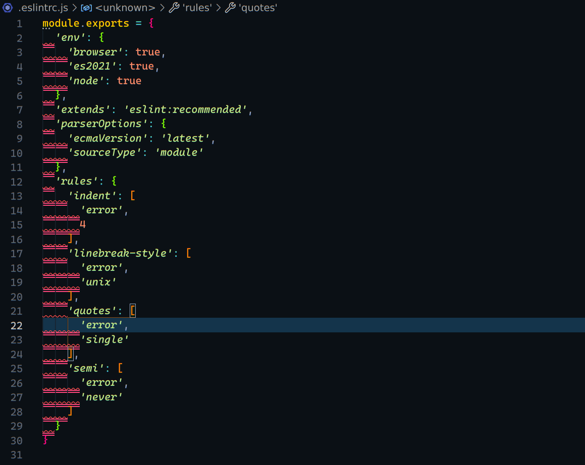
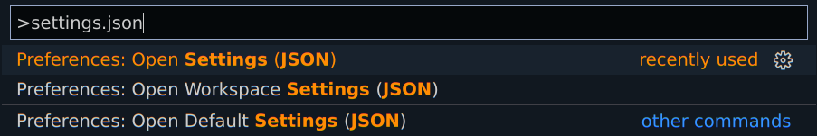
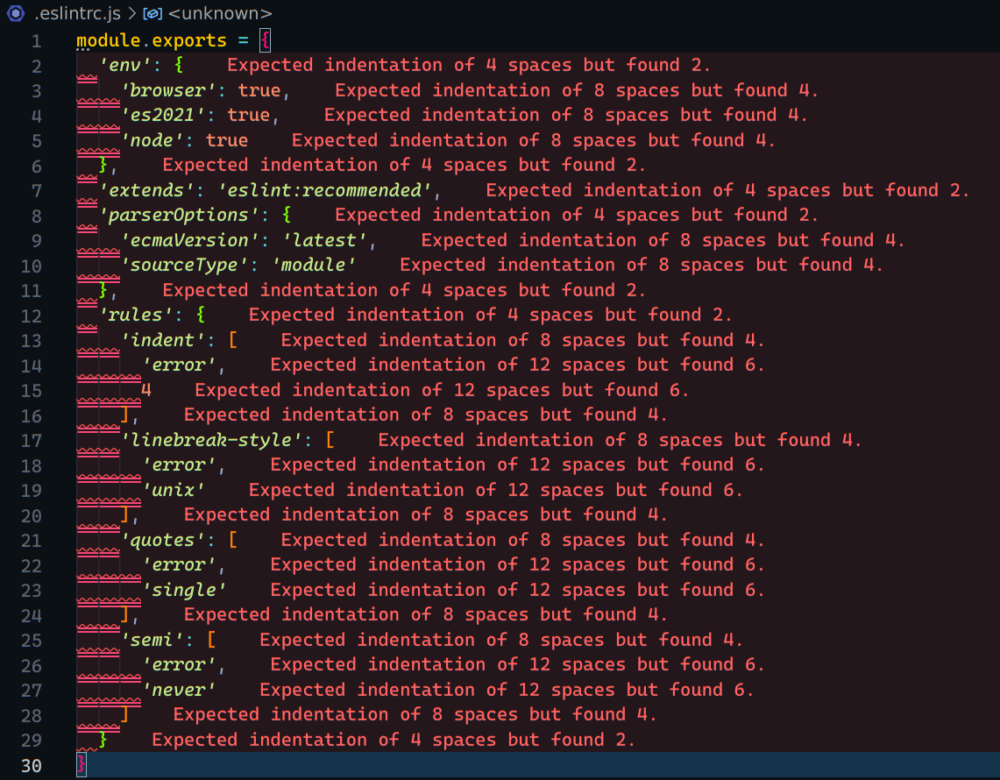

---
title: '¿Qué es ESLint y por qué deberías utilizarlo?'
date: 2022-03-24 07:00:00
image: '../../assets/images/eslint-header.png'
author: 'edicsonabel'
excerpt: 'ESLint es un linter para JavaScript y TypeScript alojado en npm, utilizado para analizar, advertir y arreglar errores en nuestro código. La extensión de ESLint en VSCode nos facilita la sintaxis cuando hacemos uso del autofix.'
tags:
  - eslint
  - javascript
  - vscode
---

A la hora de desarrollar aplicaciones, el programador hace uso de herramientas que lo ayudan a ser más eficiente y rápido para terminar su trabajo, ya sean herramientas como editores de código, librerías, IDE's y muchas más.

Una de esas herramientas son los linters, pero...

## ¿Qué son los linters?
"Linting" es el proceso de ejecutar un programa que analizará el código en busca de posibles errores. Los "linters" son dichos programas que examinan el código del programador, ayudandolo a corregir el código incorrecto, errores de sintaxis y/o normas de estilos.

Entre los linters más famosos de JavaScript, están StyleLint, TSLint para TypeScript y por supuesto ESLint.

## ¿Qué es ESLint?
Es un linter para ECMAScript, utilizado para analizar, advertir y/o arreglar errores en nuestro código, ya sea código para el Backend (Node.js) o el Frontend (Navegador).

Esta herramienta es útil debido a que en JavaScript se suele caer en muchos errores de sintaxis, por ser un lenguaje dinámico y de débilmente tipado.

## Instalación
Como ESLint en un paquete de npm, podemos añadirlo en nuestro proyecto como una dependencia de desarrollo.
```bash
# npm
npm install eslint -D
# Yarn
yarn add eslint -D
```

## Configuración
Debemos inicializar la configuración para poder decirle a ESLint como queremos que analice y arregle nuestro código, eso lo hacemos con el siguiente comando.
```bash
./node_modules/.bin/eslint --init
```
> Puede que nos pida instalar `@eslint/create-config` para poder hacer la configuración.

Debemos responder las preguntas que el configurador de ESLint nos realiza de acuerdo a las necesidades de nuestro proyecto. Cuando terminemos, se creará un archivo `.eslintrc.{js,yml,json}` en la carpeta raíz de nuestro proyecto. No importa si nos equivocamos al responder en la configuración, ten en cuenta que podemos modificar dicho archivo cuando queramos.

### ¿Cómo te gustaría usar ESLint?
```txt {4}
? How would you like to use ESLint? …
  To check syntax only
  To check syntax and find problems
▸ To check syntax, find problems, and enforce code style
```
Mi sugerencia es la opción tres, que verificar la sintaxis, encuentra problemas y hace cumplir el estilo de código en todos los archivos, así mantendrás un estándar de escritura.

### ¿Qué tipo de módulos utiliza tu proyecto?
```txt {2}
? What type of modules does your project use? …
▸ JavaScript modules (import/export)
  CommonJS (require/exports)
  None of these
```
Aquí elegimos si queremos utilizar lo nuevo de ES6, como lo es `import/export` de JavaScript Modules o nos quedamos con la antigua forma `require/exports` de CommonJS.

### ¿Qué framework utiliza su proyecto?
```txt {2}
? Which framework does your project use? …
▸ React
  Vue.js
  None of these
```
Si vamos a trabajar con un Framework, podemos elegirlo acá.

### ¿Tu proyecto usa TypeScript?
```txt
? Does your project use TypeScript? ‣ No / Yes
```

### ¿Dónde se ejecuta su código?
```txt {3}
? Where does your code run? …  (Press <space> to select, <a> to toggle all, <i> to invert selection)
✔ Browser
✔ Node
```
Se puede seleccionar una de las opciones, ambas o ninguna.

### ¿Cómo te gustaría definir un estilo para tu proyecto?
```txt {3}
? How would you like to define a style for your project? …
  Use a popular style guide
▸ Answer questions about your style
```
Podemos usar una de las guías de estilos populares en el open source, como por ejemplo [Airbnb][airbnbjs], [standard][standardjs], [Google][googlejs] o [XO][xojs]. En este caso seleccionaré la segunda opción para hacer una configuración personal.

### ¿En qué formato quieres que esté tu archivo de configuración?
```txt {2}
? What format do you want your config file to be in? …
▸ JavaScript
  YAML
  JSON
```
Aquí depende de ti, selecciona el formato que más te guste.

### ¿Qué estilo de sangría usas?
```txt {3}
? What style of indentation do you use? …
  Tabs
▸ Spaces
```
En mi caso, me gustan más los espacios así que esa seleccionaré.

### ¿Qué comillas usas para cadenas?
```txt {3}
? What quotes do you use for strings? …
  Double
▸ Single
```
Yo utilizo las comillas simples ante las comillas dobles.

### ¿Qué finales de línea usas?
```txt {2}
? What line endings do you use? …
▸ Unix
  Windows
```

### ¿Necesita puntos y comas?
```txt
? Do you require semicolons? ‣ No / Yes
```
Yo soy de los que no utiliza puntos y comas, así que selecciono que no.

Finalmente tenemos nuestro archivo de `.eslintrc.{js,yml,json}` 🙌🏻.
```txt
Successfully created .eslintrc.{js,yml,json} file in /../../repository
```

> Las extensiones `.{js,yml,json}` son opcionales en el archivo `.eslintrc`. Puedes solo crear el archivo `.eslintrc` sin ninguna extensión y allí tener tu configuración.

## ¿Cómo usar ESLint?
Luego que tengamos nuestra configuración y el archivo `.eslintrc.{js,yml,json}` esté creado en la carpeta raíz, podemos ir a la terminal de comando y ejecutar el siguiente binario para detectar los archivos que no cumplen con la configuración de nuestro proyecto.
```bash
./node_modules/.bin/eslint .
```
> El punto al final `.` del comando hace referencia a la ruta actual en la terminal. También puedes colocar una ruta especifica del proyecto cambiando el punto final `.` por la `/ruta-especifica/`.

Si ESLint detecta algún error o advertencia, lo mostrara para que lo corrijas.

```txt
/../../repository/.eslintrc.js

  2:1  error  Expected indentation of 4 spaces but found 2   indent
  3:1  error  Expected indentation of 8 spaces but found 4   indent
  4:1  error  Expected indentation of 8 spaces but found 4   indent
  5:1  error  Expected indentation of 8 spaces but found 4   indent
  6:1  error  Expected indentation of 4 spaces but found 2   indent
  7:1  error  Expected indentation of 4 spaces but found 2   indent
  8:1  error  Expected indentation of 4 spaces but found 2   indent
  9:1  error  Expected indentation of 8 spaces but found 4   indent

✖8 problems (8 errors, 0 warnings)
  8 errors and 0 warnings potentially fixable with the `--fix` option.
```

Tal como se muestra al final del mensaje, podemos arreglar los errores llamando nuevamente al binario, pero con la bandera `--fix`.
```bash
./node_modules/.bin/eslint --fix .
```

Asimismo, podemos añadir este comando a nuestro `package.json` como un script, para poder formatear el código antes de que vaya a producción con un simple `npm run format` o `yarn format`. 
```json
// package.json
...
"scripts": {
  "linter": "eslint .",
  "format": "eslint --fix .",
}
...
```

## ESLint en Visual Studio Code
Para sacarle más provecho a ESLint, puedes instalar algunas extensiones útiles para el formateo de código y la visualización de errores.

### ESLint extension
<figure class='logo'>
  
</figure>

[ESLint extension][eslintvscode] está creada por Microsoft para poder utilizar ESLint en Visual Studio Code, permitiendo leer la biblioteca ESLint instalada en la carpeta raíz del proyecto y poder formatear el código en base a esa configuración.

Para instalarla, debemos abrir el buscador de extensiones con el atajo de teclado `Ctrl + Shift + X` o en macOS `⇧ + ⌘ + X`, escribir en el buscador `eslint` y pulsar el botón de `install`.

Luego debemos reiniciar VS Code para que la extensión comience a funcionar, y pueda mostrar los errores en los archivos que no cumplan con nuestra configuración.

Ejemplo:



Una opción muy útil es el arreglar y/o formatear tu código automáticamente (autofix) cuando guardas los archivos, esto lo podemos hacer añadiendo en la configuración de VS Code unas pocas líneas de código.

Primero debemos abrir las configuraciones con el atajo de teclado `Ctrl + Shift + P`, en macOS `⇧ + ⌘ + P`, posteriormente escribir `settings.json` y pulsar enter, tal como se muestra en la imagen.



Estando en el archivo de configuración, agregamos el siguiente código y guardamos.
```json
// settings.json
...
"editor.codeActionsOnSave": {
  "source.fixAll.eslint": true
},
"[javascript]": {
  "editor.defaultFormatter": "dbaeumer.vscode-eslint"
},
...  
```

Si anteriormente usabas Prettier para formatear el código, debes borrar o deshabilitar su formateo automático.
```json
// settings.json
...
// "[javascriptreact]": {
//   "editor.defaultFormatter": "esbenp.prettier-vscode"
// },
... 
```

### Error Lens extension
<figure class='logo'>
  
</figure>

Otra extensión que puedes instalar es [Error Lens][errorlensvscode] creada por Alexander, ya que es útil para visualizar directamente en la misma línea, el mensaje de error de manera más verbosa.

Para ello, abrimos nuevamente el buscador de extensiones con el atajo de teclado `Ctrl + Shift + X` o en macOS `⇧ + ⌘ + X`, escribimos en el buscador `error lens` y pulsamos el botón de `install`.

Luego reiniciamos VS Code para que la extensión comience a funcionar, y puedan mostrarse los errores en los archivos que no cumplan con nuestra configuración.

Ejemplo:



[airbnbjs]: https://github.com/airbnb/javascript "Airbnb JavaScript Style Guide"
[standardjs]: https://github.com/standard/standard "JavaScript Standard Style"
[googlejs]: https://github.com/google/eslint-config-google "eslint-config-google"
[xojs]: https://github.com/xojs/eslint-config-xo "eslint-config-xo"
[eslintvscode]: https://marketplace.visualstudio.com/items?itemName=dbaeumer.vscode-eslint "ESLint extension"
[errorlensvscode]: https://marketplace.visualstudio.com/items?itemName=usernamehw.errorlens "Error Lens extension"
